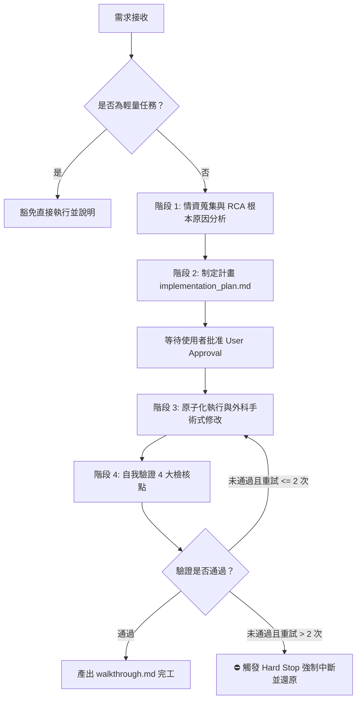

# Antigravity 智能助理客製化與技能儲存庫 (Antigravity Skills & Workflows Repository)

歡迎來到 **Gemini / Antigravity 智能儲存庫**！本儲存庫是專門用來存放與管理 **Antigravity**（進階 agentic AI 編碼助理）的**全域工作流 (Global Workflows)**、**官方標準插件包 (Plugin Bundles)**、**獨立通用技能 (Standalone Skills)**，以及**專案開發全局規範 (GEMINI.md)**。

藉由將此儲存庫獨立，可方便在多台不同裝置與多個專案工作區中，以 Git Submodule 或獨立儲存庫的形式引入這套強大的 AI 開發增強系統。

---

## 📂 目錄結構與模組架構 (Repository Structure)

本儲存庫的核心目錄結構如下：

```directory
.
├── GEMINI.md                     # 專案全局開發規範（語言規範、終端機指令、敏感資訊防護、型別安全等）
├── README.md                     # 本說明文件
├── split_SOP.md                  # 本儲存庫從母專案拆分出來的標準作業程序 (SOP)
├── sync.bat                      # 自動化同步啟動器（呼叫 sync_config.ps1）
├── sync1.bat                     # 純 Batch 模式同步腳本（免 PowerShell 環境通用）
├── sync_config.ps1               # PowerShell 同步核心腳本（自動鏡像至 IDE 設定並清理舊版殘留）
└── antigravity/                  # Antigravity 核心增強目錄
    ├── global_workflows/         # 🚀 全域工作流指引 (Global Workflows)
    │   └── core-development-workflow.md  # 核心開發流程（規劃優先、原子化執行、強制中斷機制）
    ├── plugins/                  # 🧩 官方標準插件包 (Plugin Bundles，自動探索與加載)
    │   ├── ai-custom/            # 🧠 核心客製化 AI 專業能力模組 (Taiwan Context)
    │   │   ├── plugin.json       # 插件宣告設定檔
    │   │   └── skills/           # 包含總經研究、ETF分析、腳本防禦、多益助教等 6 項技能
    │   ├── cloudflare/           # ⚡ Cloudflare 全套無伺服器與邊緣運算技能包
    │   │   ├── plugin.json       # 插件宣告設定檔
    │   │   └── skills/           # 包含 workers-best-practices, wrangler, agents-sdk 等 9 項技能
    │   └── google-cloud/         # ☁️ Google Cloud 與企業級雲端架構技能包
    │       ├── plugin.json       # 插件宣告設定檔
    │       └── skills/           # 包含 gemini-api, gke-basics, bigquery-basics 等 13 項技能
    └── skills/                   # 🛠️ 獨立全域通用技能 (Standalone Skills)
        ├── adk-tool-scaffold/    # 增強工具腳手架（自動生成客製化 Tool 類別）
        ├── code-review/          # 自動化程式碼審查與品質控制技能
        ├── database-schema-validator/  # SQL Schema 安全與命名規範自動驗證器
        ├── git-commit-formatter/ # 規範化 Commit Message 格式化工具 (Conventional Commits)
        ├── how/                  # 深層系統架構剖析與設計模式評估技能
        ├── json-to-pydantic/     # JSON 結構自動轉換為 Pydantic 資料模型工具
        └── license-header-adder/ # 自動為新原始碼檔案添加企業授權標頭的工具
```

---

## 🚀 核心工作流程指引 (Global Workflow Guide)

### 核心開發流程 ([`core-development-workflow.md`](./antigravity/global_workflows/core-development-workflow.md))

為避免盲目試錯並確保程式碼變更具備「外科手術式的精準」，AI 在接收到任何非瑣碎任務時，強制進入 **Planning Mode (規劃模式)**，並嚴格遵循以下四階段流程：



1. **階段 1：情資蒐集與根本原因分析 (Reconnaissance & RCA)**
   - 謀定而後動：深入閱讀相關程式碼與依賴關係。
   - 遇到不清楚或需求有歧義時主動提問，絕不默默猜測。
   - 修復 Bug 時必須追溯源頭，明確指出造成 Bug 的核心邏輯缺陷。
2. **階段 2：制定計畫 (Implementation Plan)**
   - 目標驅動：將指令轉化為「可驗證的目標」。
   - 以 Markdown 格式輸出具體計畫 (`implementation_plan.md`)，明列修改位置與驗證方式，**必須獲得使用者核准後方可動工**。
3. **階段 3：原子化執行 (Atomic Execution)**
   - 一次只做一件事：嚴禁將修 Bug 與新功能混雜。
   - 極簡至上：以最少且必要的程式碼解決問題，不做多餘抽象。
   - 外科手術式修改：僅修改計畫範圍內的代碼，嚴禁未經指示順手優化無關程式碼。
4. **階段 4：自我驗證與強制中斷 (Self-Verification & Hard Stop)**
   - 四項自我檢查：**範圍確認**（逐行比對 diff）、**成功標準**（達成驗證條件）、**依賴檢查**（無未宣告套件）、**型別安全**（防止 `NaN` 或破版）。
   - ⛔ **強制中斷機制**：若執行後仍有錯誤且重試超過 2 次，強制中斷、還原變更，並向使用者回報具體日誌等待新指示。

> ⚡ **輕量任務豁免條款**：若任務屬於「單行錯別字修正」或「顯而易見的一行修改」等瑣碎操作，可跳過完整四階段流程，直接執行並說明原因。

---

## 🧩 插件與技能完整矩陣 (Skills & Plugins Matrix)

本儲存庫目前共包含 **3 大官方標準插件包（共 28 項專業技能）** 與 **7 項獨立全域通用技能**：

### 1. 🧠 AI 客製化專業插件 (`plugins/ai-custom/`)

| 技能名稱 | 說明與核心價值 |
| :--- | :--- |
| **`macro-investment-research`** | **全球總體經濟與大類資產配置研究**：決策樹指揮官架構、四大總經模型組合拳、Fed 貨幣政策與利率傳導模型、大宗商品超級週期分析、歷史泡沫比對。 |
| **`etf-prospect-report`** | **美股 ETF 前景與分析報告**：Orchestrator + References 架構，嚴格遵循 ETF 專屬評價指標（嚴禁混用個股指標），提供多維度風險矩陣與配置建議。 |
| **`windows-script-guard`** | **Windows 腳本防禦守衛**：強制採用 UTF-8 with BOM 機制防止中文字元亂碼、避免 PowerShell 偏僻語法、處置工作區檔案解碼死結。 |
| **`toeic-vocab-assistant`** | **多益 860+ 高頻單字助教**：專為台灣學習者設計，自動排版 Markdown 欄位，強制使用台灣商業用語習慣與反幻覺精準翻譯。 |
| **`grammar-book-author`** | **英文文法書籍作家**：專業語言學深度展開，根據大綱撰寫高品質文法教材與解析。 |
| **`skill-security-reviewer`** | **技能安全審查員**：審查自訂技能目錄中的安全性風險、社交工程暗門與潛在惡意邏輯。 |

### 2. ⚡ Cloudflare 邊緣生態插件 (`plugins/cloudflare/`)

| 技能名稱 | 說明與核心價值 |
| :--- | :--- |
| **`security-audit`** | **高階資安審查與漏洞掃描**：系統漏洞掃描、商業邏輯缺陷測試、生成標準化 `REPORT.md` 與 `findings.json`。 |
| **`agents-sdk`** | **Cloudflare Agents SDK**：建置狀態化 AI Agent、持久化工作流、Real-time WebSocket 與 RPC 調用。 |
| **`cloudflare`** | **全方位 Cloudflare 開發指南**：涵蓋 Workers, KV, D1, R2, Vectorize, AI, 網路與安全架構。 |
| **`cloudflare-email-service`** | **交易型郵件服務**：Workers 郵件綁定、REST API、郵件路由與 SPF/DKIM/DMARC 整合。 |
| **`durable-objects`** | **Durable Objects 狀態協同**：分散式鎖、即時通訊室、SQLite 儲存與 Alarms 機制。 |
| **`sandbox-sdk`** | **代碼沙盒執行環境**：安全執行未受信任代碼、Code Interpreter 與預覽環境建置。 |
| **`web-perf`** | **網站效能分析**：Core Web Vitals (LCP, INP, CLS)、載入阻塞分析與 Lighthouse 最佳化。 |
| **`workers-best-practices`** | **Workers 最佳實踐**：串流處理、狀態管理、密鑰保護與反模式審查。 |
| **`wrangler`** | **Wrangler CLI 指南**：Workers 開發、部署、設定檔與全套生態系命令最佳實踐。 |

### 3. ☁️ Google Cloud 企業雲端插件 (`plugins/google-cloud/`)

| 技能名稱 | 說明與核心價值 |
| :--- | :--- |
| **`gemini-api`** | **Google Gen AI SDK 與企業級 Gemini API**：Live API、多模態生成、模型微調與快取最佳實踐。 |
| **`gke-basics`** | **Google Kubernetes Engine (GKE)**：Autopilot 黃金路徑、私有叢集、網路與安全性配置。 |
| **`bigquery-basics`** | **BigQuery 巨量資料分析**：資料集管理、高效 SQL 查詢、BigQuery ML 與 Gemini 整合。 |
| **`cloud-run-basics`** | **Cloud Run 服務與作業**：容器化 HTTP 服務、排程工作與背景常駐處理管理。 |
| **`cloud-sql-basics`** | **Cloud SQL 關聯式資料庫**：MySQL、PostgreSQL、SQL Server 佈署與高可用管理。 |
| **`alloydb-basics`** | **AlloyDB for PostgreSQL**：高階資料庫叢集管理、備份與 MCP 工具整合。 |
| **`firebase-basics`** | **Firebase 應用開發**：行動/Web 應用認證、Firestore、雲端函式整合。 |
| **`google-cloud-networking-observability`** | **網路可觀測性分析**：VPC Flow Logs、NAT、防火牆日誌分析與 Connectivity Tests 路徑診斷。 |
| **`google-cloud-recipe-auth`** | **認證與授權最佳實踐**：服務帳戶、Workload Identity、應用程式預設憑證 (ADC)。 |
| **`google-cloud-recipe-onboarding`** | **GCP 快速上手指引**：專案建立、計費配置與首個雲端資源部署。 |
| **`google-cloud-waf-cost-optimization`** | **架構良好框架 - 成本最佳化**：工作負載成本評估與資源利用率最佳化建議。 |
| **`google-cloud-waf-reliability`** | **架構良好框架 - 可靠性設計**：高可用性架構、容錯機制與災難復原指引。 |
| **`google-cloud-waf-security`** | **架構良好框架 - 安全性防護**：IAM 最小權限、網路安全邊界與資料防護機制。 |

### 4. 🛠️ 獨立全域通用技能 (`skills/`)

| 技能名稱 | 說明與核心價值 |
| :--- | :--- |
| **`git-commit-formatter`** | **規範化 Commit 訊息**：嚴格遵循 Conventional Commits 規範，強制使用台灣繁體中文撰寫。 |
| **`code-review`** | **自動化程式碼審查**：審查 PR 與變更，聚焦於潛在 Bug、風格規範與邊界條件。 |
| **`how`** | **深層架構剖析**：深入探索程式碼庫並產出清晰的架構說明與設計模式評估。 |
| **`database-schema-validator`** | **資料庫綱要驗證**：自動檢驗 SQL Schema 檔案之命名與安全性規範。 |
| **`json-to-pydantic`** | **Pydantic 模型轉換**：將 JSON 資料片段自動轉換為強型別 Python Pydantic 資料模型。 |
| **`adk-tool-scaffold`** | **ADK 工具腳手架**：快速生成符合 Agent Development Kit 規範之客製化 Tool 類別。 |
| **`license-header-adder`** | **授權標頭自動加入**：自動為新原始碼檔案添加企業標準授權標頭宣告。 |

---

## ⚙️ 專案開發全局規範 ([`GEMINI.md`](./GEMINI.md))

根目錄下的 [`GEMINI.md`](./GEMINI.md) 定義了 AI 助理在開發時必須絕對無條件遵守的最高邊界：

> [!IMPORTANT]
> ### 🚨 最高權限強制規範 (Critical Priority)
> 1. **語言輸出最高規範**：任何技能（如 git-commit-formatter、wrangler、agents-sdk 等）產生的**所有輸出、Git 提交訊息 (Commit Message)、程式碼註解、系統日誌與說明，都必須嚴格且無條件地完全使用繁體中文 (zh-TW) 與台灣科技用語**。本規範具最高優先權，覆蓋所有外掛技能預設範本。
> 2. **終端機指令執行規範（避免複合指令）**：在執行終端機指令時，**絕對禁止使用 `&&` 串接，且應避免使用分號 `;` 串接**。配合系統安全沙盒與權限白名單機制，**必須將需要連續執行的指令拆分成多次獨立的發送動作**，以確保指令能順利通過驗證並執行。

### 核心開發四大準則
1. **環境與架構確認**：嚴格遵守既有架構。修改前必須確認當前 Git Worktree 狀態，避免跨環境污染。變數與函式命名需具備高度描述性，遇複雜邏輯必須加入**繁體中文詳細註解**。
2. **嚴格資安與限制事項**：
   - **敏感資訊防護**：絕對禁止在程式碼中寫死（Hardcode）任何 API Key、密碼或金鑰，僅可留註解說明，真實數值一律由環境變數或 `.env` 讀取。
   - **精準局部替換 (Exact Diff/Replace)**：修改大型檔案時，必須提供上下 3 至 5 行原始程式碼作為精確錨點，嚴禁盲目覆寫或使用 `...` 略過。
   - **型別安全 (Type Safety)**：資料處理強制實作型別轉換，杜絕畫面出現 `NaN`、`undefined` 或版面破裂。
3. **開發流程規範 (Workflow Guidelines)**：
   - **規劃優先 (Plan First)**：非瑣碎任務必須先提交 `implementation_plan.md` 並獲得使用者核准後方可動工。
   - **進度透明**：執行中透過 `task.md` 追蹤進度，完工後產出 `walkthrough.md` 說明變更與驗證成果。
4. **指令獨立發送**：終端機指令保持單一獨立執行。

---

## 🔄 同步與更新指引 (Sync Guide)

當您在不同電腦或不同工作區引入此儲存庫後，可執行根目錄下的自動化同步工具，將全域工作流、規範與插件鏡像至本機 Antigravity IDE 設定目錄：

* **PowerShell 啟動器**：執行 [`./sync.bat`](./sync.bat)（將呼叫 [`./sync_config.ps1`](./sync_config.ps1) 執行自動同步與舊版殘留清理）。
* **純 Batch 獨立模式**：執行 [`./sync1.bat`](./sync1.bat)（採用純 ASCII 與原生 CMD 指令，適用於無法執行 PowerShell 或受限環境）。
* **PowerShell 核心腳本**：[`./sync_config.ps1`](./sync_config.ps1)（具備路徑自動偵測、新版 IDE 目錄鏡像、舊版殘留清除與多重相容備份功能）。

### 🧩 官方 Plugin 插件機制（零配置自動探索）

本專案全面導入 Antigravity 官方標準的 **Plugin 架構**：
1. **零設定檔維護 (Zero-Config)**：完全廢棄且不再維護舊版 `skills.json`。只要將分類技能置於 `plugins/<plugin_name>/skills/` 並配置 `plugin.json`，Antigravity 便會在啟動或開新對話時**自動探索並加載所有技能**。
2. **自動清理舊版殘留**：同步腳本內建清理邏輯，會自動清除 `%USERPROFILE%\.gemini\config\` 底下的舊版 `skills.json` 及舊分類資料夾（`AI_custom`, `CloudFlare`, `cloud`），確保全域環境乾淨且零衝突。

### 🆕 新舊版 IDE 路徑對照表

| 項目 | 舊版 Antigravity 存放路徑 | 新版 Antigravity IDE 存放路徑 | 說明 |
| :--- | :--- | :--- | :--- |
| **全域設定根目錄** | `%USERPROFILE%\.gemini\` | `%USERPROFILE%\.gemini\config\` | 新版全域配置集中存放位置 |
| **插件包 (Plugins)** | 無 (舊版以子目錄存放於 skills) | `%USERPROFILE%\.gemini\config\plugins\` | 內含 `plugin.json` 與所屬技能，IDE 自動加載 |
| **通用技能 (Skills)** | `%USERPROFILE%\.gemini\antigravity\skills\` | `%USERPROFILE%\.gemini\config\skills\` | 獨立通用技能 (Standalone Skills) |
| **工作流 (Workflows)** | `%USERPROFILE%\.gemini\antigravity\global_workflows\` | `%USERPROFILE%\.gemini\config\global_workflows\` | 全域開發指引 (`core-development-workflow.md`) |
| **全域規範檔案 (Global Rules)** | `%USERPROFILE%\.gemini\GEMINI.md` | `%USERPROFILE%\.gemini\config\AGENTS.md` | 全域通用約束與行為規範（同步保留舊版備份一份） |
| **技能清單檔 (skills.json)** | 舊版自訂配置清單 | **已完全廢棄並自動清理** | 改由 Plugin 自動探索機制取代 |

---

## 🔗 歷史拆分與參考來源 (References & Sources)

* 📋 **[子目錄獨立拆分 SOP (`split_SOP.md`)](./split_SOP.md)**：詳細記錄如何使用 `git subtree split` 將本儲存庫從母儲存庫中乾淨拆分，並完美保留所有歷史 Commit 的標準作業程序。
* 🚀 **[rominirani/antigravity-skills](https://github.com/rominirani/antigravity-skills)**：Antigravity 技能的基礎概念與核心框架參考。
* 🧠 **[multica-ai/andrej-karpathy-skills](https://github.com/multica-ai/andrej-karpathy-skills)**：Andrej Karpathy 開發哲學之 AI 編碼輔助與極簡實作技能。
* 🌐 **[google/skills](https://github.com/google/skills)**：Google 官方 Agent 技能開發最佳實踐與架構指南。
* ⚡ **[cloudflare/skills](https://github.com/cloudflare/skills)**：Cloudflare 無伺服器環境 (Workers / DO) 的 AI 智能助理技能參考。
* 🛡️ **[cloudflare/security-audit-skill](https://github.com/cloudflare/security-audit-skill)**：高階資安審查框架，提供程式碼漏洞掃描與架構滲透的標準化實作。
