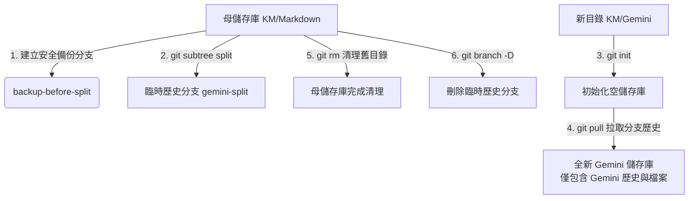

# Git Subtree 子目錄獨立拆分標準作業程序 (SOP)
## Git Subdirectory Extraction Standard Operating Procedure

本標準作業程序（SOP）旨在詳細解說如何將一個既有 Git 儲存庫（母儲存庫）中的特定子目錄，獨立拆分出來成為一個全新的 Git 儲存庫（子儲存庫），同時**完美保留所有與該子目錄相關的歷史 Commit 紀錄**。

在本次操作中，我們成功將 `Prompt/Gemini` 從 `KM/Markdown` 中拆分，並在 `KM/Gemini` 建立了獨立儲存庫。

---

## 🎯 核心原理與技術選擇

當需要將子目錄獨立時，常見的技術方案有 `git filter-branch`、`git-filter-repo` 與 `git subtree`。
本 SOP 採用 **`git subtree split`** 方案，其核心優勢為：
1. **內建功能**：Git 原生支援，在 Windows 環境下不需額外安裝 Python 或第三方套件。
2. **無破壞性**：僅會從既有歷史中「過濾/投影」出新分支，絕不修改或破壞母儲存庫現有的分支歷史。
3. **歷史完整**：能精準辨識出所有對該子目錄進行過修改的 Commit，並將其重新組合為一個乾淨的、以該子目錄為根目錄的新 Git 歷史線。

---

## 📋 拆分流程圖解 (Architecture Workflow)



---

## 🛠️ 詳細實作步驟 (Detailed Steps)

### 📌 階段一：準備與安全防護
1. **暫停雲端同步**：
   * 由於儲存庫路徑位於 `Google Drive` 同步資料夾下，為避免 Git 頻繁重寫檔案時與雲端同步機制產生檔案鎖定（File Lock）或同步衝突，**強烈建議在執行前暫停 Google Drive 同步**。
2. **確保工作區乾淨**：
   * 在母儲存庫根目錄下執行：
     ```powershell
     git status
     ```
   * 必須確認輸出為 `nothing to commit, working tree clean`，否則請先進行 `commit` 或 `stash`。

---

### 📌 階段二：歷史分離與備份 (母儲存庫)
1. **建立本地安全備份分支**：
   * 為了防範任何非預期的 Git 操作失誤，先建立一個本地備份指標：
     ```powershell
     git branch backup-before-split
     ```
2. **過濾並分離歷史紀錄**：
   * 執行 subtree 分割指令，將指定的子目錄歷史過濾並產生至臨時分支：
     ```powershell
     git subtree split --prefix=Prompt/Gemini -b gemini-split
     ```
     > **💡 指令原理解析**：
     > * `--prefix=Prompt/Gemini`：指定要被獨立出來的子目錄路徑（必須相對於儲存庫根目錄）。
     > * `-b gemini-split`：指定過濾後的歷史 Commit 要存放在哪一個新分支名稱（此分支只會有 Gemini 的檔案，且檔案會被自動移至根目錄）。

---

### 📌 階段三：初始化與導入歷史 (子儲存庫)
1. **建立新資料夾**：
   * 在您指定的目標路徑建立全新資料夾：
     ```powershell
     New-Item -ItemType Directory -Path "C:\Users\phileo\Desktop\Google Drive\KM\Gemini" -Force
     ```
2. **初始化全新的 Git 儲存庫**：
   * 進入該新資料夾並初始化 Git：
     ```powershell
     cd "C:\Users\phileo\Desktop\Google Drive\KM\Gemini"
     git init
     ```
3. **拉取過濾後的歷史紀錄**：
   * 將母儲存庫中的臨時分支歷史拉入新的儲存庫中：
     ```powershell
     git pull "C:\Users\phileo\Desktop\Google Drive\KM\Markdown" gemini-split
     ```
     > **💡 執行結果**：拉取成功後，您會發現原本在 `Prompt/Gemini` 目錄下的所有檔案，現在已全部平鋪呈現在新儲存庫的根目錄下，且執行 `git log` 可完整查看到過去所有相關的 Commit 歷程。

---

### 📌 階段四：母儲存庫清理與維護
1. **回到母儲存庫並切換至主分支**：
   ```powershell
   cd "C:\Users\phileo\Desktop\Google Drive\KM\Markdown"
   ```
2. **從 Git 追蹤中移除舊目錄**：
   ```powershell
   git rm -r Prompt/Gemini
   ```
3. **提交此清理變更**：
   ```powershell
   git commit -m "chore(gemini): 拆分並移除此子目錄至獨立 Repository"
   ```
4. **刪除母儲存庫中的臨時分支**：
   * 臨時分支已無利用價值，予以刪除以維持 Git Tree 乾淨：
     ```powershell
     git branch -D gemini-split
     ```
5. **清理磁碟上的空資料夾殘留**：
   * 由於 Git 只管理檔案，`git rm` 刪除檔案後，硬碟上可能會殘留空資料夾外殼。請執行以下命令徹底清除：
     ```powershell
     Remove-Item -Path "Prompt/Gemini" -Recurse -Force
     ```

---

## 🧪 驗證機制 (Verification)

為確保拆分 100% 成功，請執行以下三項檢查：

1. **新儲存庫完整性驗證**：
   * 進入 `C:\Users\phileo\Desktop\Google Drive\KM\Gemini`，確認核心檔案（如 `GEMINI.md`、`sync.bat`）皆位於根目錄下。
2. **新儲存庫歷史追溯驗證**：
   * 在新儲存庫執行：
     ```powershell
     git log -n 5
     ```
   * 確認輸出包含該目錄過去的所有 Commit，且作者與日期資訊皆完整保留。
3. **母儲存庫清理驗證**：
   * 在母儲存庫下執行 `git status`，確認無任何未追蹤的殘留檔案，且工作區呈乾淨狀態。

---

## ⚠️ 常見問題排除 (FAQ)

### Q1：執行 `git subtree split` 時命令卡住或跑很久？
* **解答**：這是正常的。Git 需要逐一掃描母儲存庫歷史中的每一個 Commit，檢查它是否有修改到指定目錄。若您的儲存庫歷史非常龐大，這可能需要數十秒到數分鐘。請耐心等待其完成。

### Q2：為什麼在 Windows PowerShell 下執行會出現檔案鎖定錯誤？
* **解答**：這通常是因為 Google Drive 或防毒軟體正在背景掃描新產生的暫存檔案。請務必在操作前暫停 Google Drive 同步，並關閉任何佔用該資料夾的終端機或編輯器。
